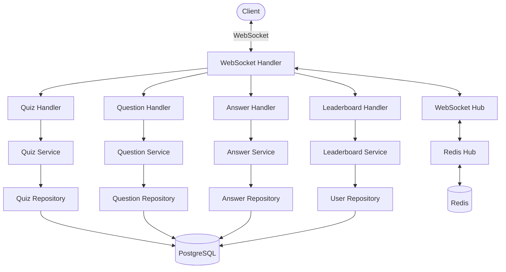
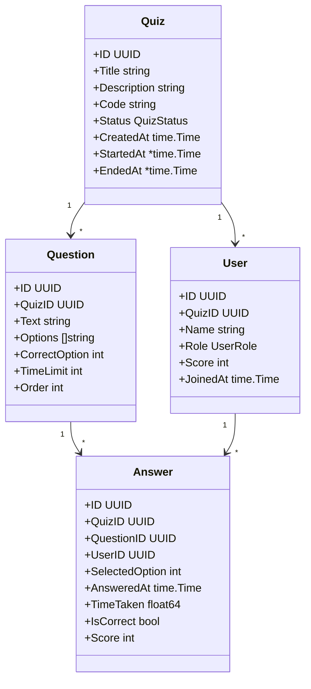
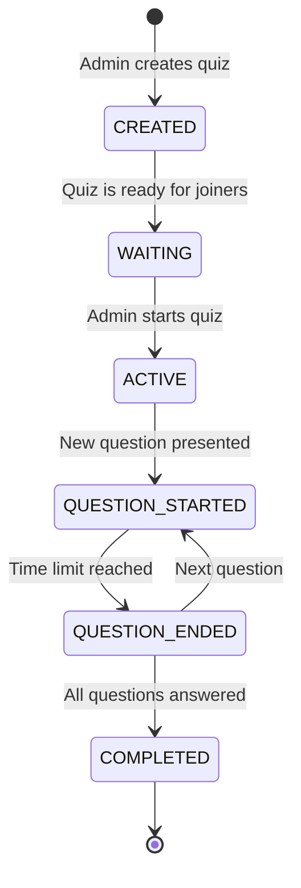
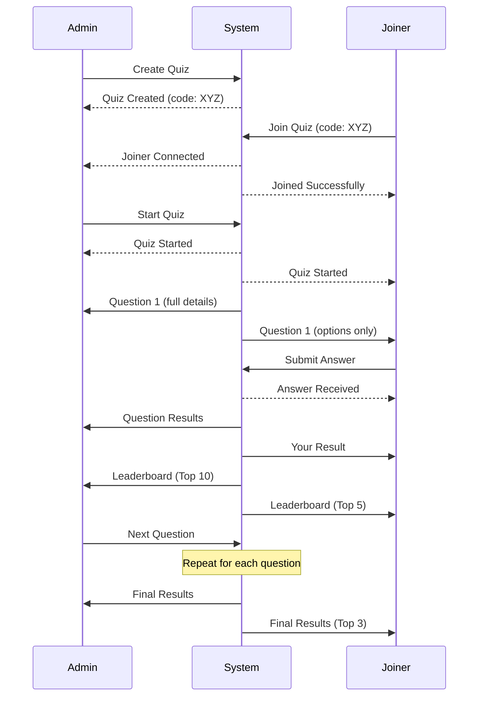

# Real-Time Quiz Backend

A real-time quiz application backend built with Go, featuring WebSocket for real-time communication, PostgreSQL for data persistence, and Redis for pub/sub functionality.

## Requirements

### Overview
The Real-Time Quiz application is designed to be a Kahoot-like platform where:
- **Admin users** can create quizzes, control the flow, and view results
- **Joiners** can participate in quizzes in real-time, answer questions, and view leaderboards

### Functional Requirements

#### User Roles
- **Admin**: Creates and manages quizzes, controls quiz flow, views all results
- **Joiner**: Joins quizzes with a unique ID, answers questions, views limited results

#### Quiz Flow
1. Admin creates a quiz with multiple questions
2. Joiners enter the quiz using a unique ID
3. Admin starts the quiz
4. Questions are presented one at a time with configurable time limits
5. Participants answer within the time limit
6. Scores are calculated based on correctness and speed
7. Leaderboard updates in real-time
8. Final results display at the end

#### Real-Time Requirements
- Synchronized quiz progression for all participants
- Instant feedback on answers
- Live leaderboard updates
- Server-controlled timing for fairness

### Technical Requirements
- **Backend**: Go with WebSockets for real-time communication
- **Database**: PostgreSQL for persistent storage
- **Caching**: Redis for pub/sub and temporary data
- **Architecture**: Clean, modular design with clear separation of concerns

## Architecture

### System Architecture



### Component Design



### Quiz State Machine



### WebSocket Communication Flow



## Tech Stack

- **Backend Language**: Go 1.19+
- **Web Framework**: Gin for HTTP routing
- **WebSocket**: Gorilla WebSockets for real-time communication
- **Database**: PostgreSQL for persistent storage
- **Caching/PubSub**: Redis for distributed real-time communication
- **Containerization**: Docker and Docker Compose
- **API Documentation**: Swagger/OpenAPI

## Project Structure

```
real-time-quiz-backend/
├── cmd/
│   └── main.go                 # Application entry point
├── internal/
│   ├── config/                 # Configuration management
│   ├── handler/                # HTTP and WebSocket handlers
│   ├── middleware/             # HTTP middleware
│   ├── model/                  # Data models
│   ├── repository/             # Data access layer
│   └── service/                # Business logic layer
├── migrations/                 # Database migrations
└── pkg/                        # Shared packages
    ├── logger/                 # Logging utilities
    ├── validator/              # Input validation
    └── websocket/              # WebSocket implementation
```

## Current Implementation Progress

| Feature | Status | Notes |
|---------|--------|-------|
| Quiz CRUD | ✅ Complete | Admin can create, read, update, and delete quizzes |
| Question Management | ✅ Complete | Admin can add questions with options and time limits |
| User Registration | ✅ Complete | Users can register as Admin or Joiner |
| WebSocket Connection | ✅ Complete | Real-time communication infrastructure is in place |
| Quiz Joining | ✅ Complete | Joiners can enter quiz rooms with unique codes |
| Answer Submission | ✅ Complete | Joiners can submit answers in real-time |
| Scoring Mechanism | ✅ Complete | System calculates scores based on correctness and time |
| Leaderboard | ✅ Complete | Basic leaderboard functionality is implemented |
| Quiz Flow Control | 🟡 Partial | Admin can start quizzes, needs refinement |
| Question Timer | 🟡 Partial | Time limits are tracked, but synchronization needs work |
| Final Results | 🔴 Pending | End-of-quiz results display needs implementation |

## TODO to Fulfill Requirements

1. **Quiz Flow Enhancements**
   - Implement proper state transitions between questions
   - Add question timer synchronization across all clients
   - Create question transition animations/states

2. **Admin Controls**
   - Add controls for manually advancing questions
   - Implement pause/resume functionality
   - Add ability to kick users or reset quiz

3. **Joiner Experience**
   - Improve answer option display (hide question text, show only A, B, C, D)
   - Add waiting room experience
   - Implement correct/incorrect feedback

4. **Leaderboard Refinement**
   - Limit top users display as per requirements (top 5/10 for admin, top 3 for final)
   - Add score change indicators
   - Implement position change animations

5. **Performance Optimizations**
   - Add caching for frequently accessed data
   - Optimize WebSocket message size
   - Implement connection heartbeats

6. **Security Enhancements**
   - Add rate limiting for answer submissions
   - Implement safeguards against cheating
   - Add input validation and sanitization

## Getting Started

### Prerequisites

- Go 1.19+
- Docker and Docker Compose
- PostgreSQL
- Redis

### Running the Application

1. Clone the repository
2. Run with Docker Compose:

```bash
docker-compose up -d
```

3. The API will be available at http://localhost:8080
4. WebSocket connections can be established at ws://localhost:8080/ws

## API Endpoints

- `GET /api/quizzes` - List all quizzes
- `GET /api/quizzes/{id}` - Get quiz details
- `POST /api/quizzes` - Create a new quiz
- `GET /api/questions/{quizId}` - Get questions for a quiz
- `POST /api/answers` - Submit an answer
- `GET /api/leaderboard/{quizId}` - Get quiz leaderboard

## WebSocket Events

- `join_quiz` - Join a quiz session
- `submit_answer` - Submit an answer to a question
- `quiz_update` - Receive updates about the quiz status
- `leaderboard_update` - Receive real-time leaderboard updates
- `question_start` - A new question has started
- `question_end` - The current question has ended
- `quiz_complete` - The quiz has ended, final results
- `user_joined` - A new user has joined the quiz
- `error` - An error occurred

## Development

### Adding a New Feature

1. Define models in `internal/model/`
2. Create repository interfaces and implementations in `internal/repository/`
3. Implement business logic in `internal/service/`
4. Create handlers in `internal/handler/`
5. Define WebSocket events if necessary in `pkg/websocket/`
6. Update API routes in `cmd/main.go`

### Running Tests

```bash
go test ./...
```

## License

This project is licensed under the MIT License - see the LICENSE file for details.