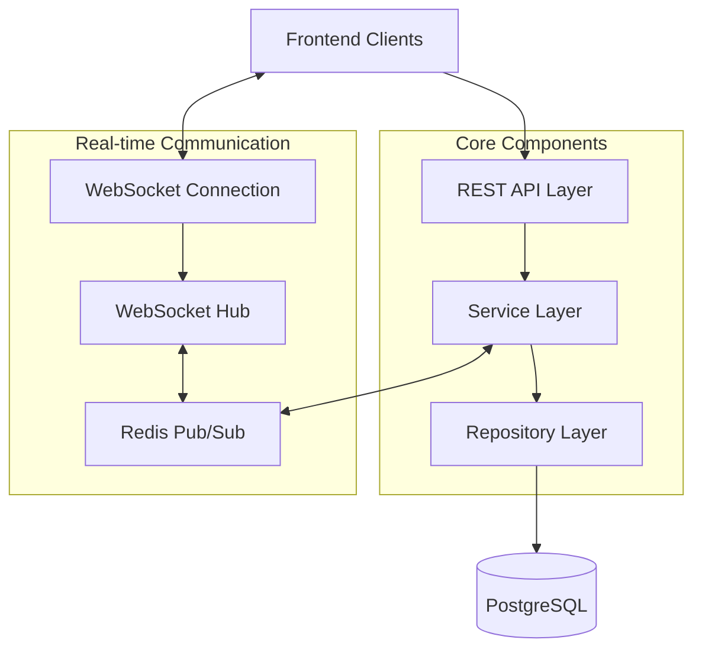
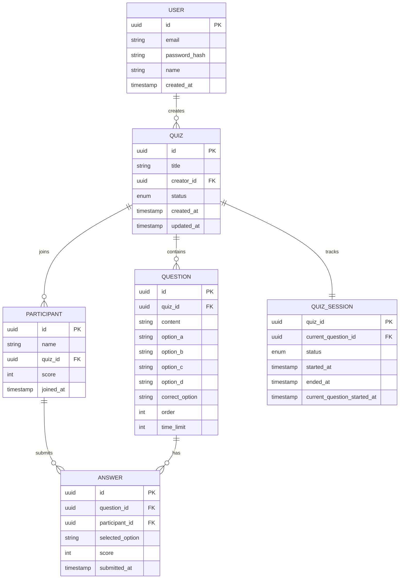
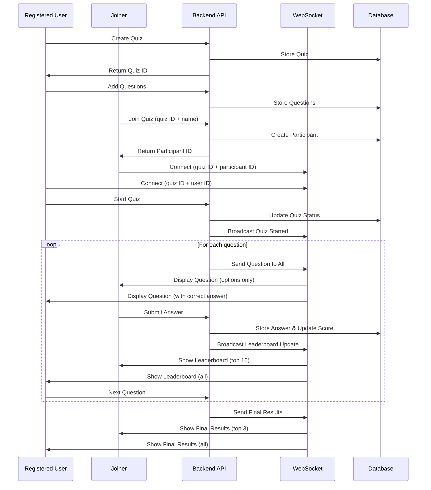

# Real-Time Quiz Application (Kahoot-like)

A real-time interactive quiz application that allows registered users to create and manage quizzes, while others can join and participate without registration.

## Requirements

### User Roles
- **Registered Users**: Can create and manage multiple quizzes
- **Joiners**: Can participate in quizzes without registration by simply entering their name

### Quiz Flow
1. A registered user creates a quiz with multiple questions
2. They share a unique link with potential participants
3. Participants join by entering their name
4. The quiz creator starts the quiz
5. Questions are presented one at a time with configurable time limits
6. Participants answer within the time limit
7. After all questions, final results are shown

### Real-Time Features
- Live leaderboard updates
- Synchronized question timing across all participants
- Real-time answer submission and scoring

## System Architecture

### High-Level Architecture



Our architecture follows a layered approach with clear separation of concerns:

1. **Client Layer**: Frontend applications (web, mobile) that interact with our backend through both REST API and WebSocket connections.

2. **API Layer**: RESTful API endpoints built with Gin framework handling HTTP requests for:
   - User authentication and management
   - Quiz creation and configuration
   - Question management
   - Answer submission and validation
   - Leaderboard retrieval

3. **WebSocket Layer**: Real-time communication using Gorilla WebSockets for:
   - Live quiz updates to all participants
   - Question timing synchronization
   - Immediate answer feedback
   - Real-time leaderboard updates

4. **Service Layer**: Business logic encapsulation with:
   - User service: Authentication, registration, profile management
   - Quiz service: Quiz lifecycle management (create, start, end)
   - Question service: Question management and sequencing
   - Participant service: Handling participant connections and state
   - Answer service: Processing and scoring participant answers
   - Leaderboard service: Calculating and maintaining real-time standings

5. **Repository Layer**: Data access abstraction with:
   - PostgreSQL repositories for persistent data storage
   - Clean separation between business logic and data access

6. **Data Storage**:
   - PostgreSQL: Primary relational database for all persistent data
   - Redis: For WebSocket pub/sub, caching, and session management

7. **Communication Patterns**:
   - Request/Response: For REST API calls
   - Pub/Sub: For real-time event broadcasting via Redis
   - WebSockets: For bidirectional client-server communication

This architecture provides:
- **Scalability**: Services can be scaled independently
- **Maintainability**: Clear separation of concerns
- **Reliability**: Robust error handling and state management
- **Performance**: Efficient real-time communication for interactive quiz experience

### Database Schema



### API Flow



## Tech Stack

- **Backend**: Go (Golang)
  - Gin framework for HTTP API
  - Gorilla WebSockets for real-time communication
  - Redis for pub/sub and caching
  - PostgreSQL for data persistence
  
- **Data Storage**:
  - PostgreSQL: Primary database for storing quiz data, questions, users, and answers
  - Redis: For real-time communication, leaderboard caching, and session management

## Recent Changes and Current Implementation Status

- ✅ Refactored the user model to separate Users (creators) and Participants
- ✅ Updated WebSocket implementation to distinguish between creators and participants
- ✅ Improved real-time event broadcasting with specific targeting (to creators or participants)
- ✅ Implemented user registration and login endpoints
- ✅ Enhanced architecture documentation and system design explanations
- ✅ Standardized DTO naming convention - removed redundant "Dto" suffix from DTOs in the dto package
- ✅ Implemented unified API response pattern with standardized error and success handling
- ✅ Created consistent response formatting across all API endpoints

### Current Implementation Status

- ✅ Basic API structure with handlers, services, and repositories
- ✅ User authentication endpoints (registration, login)
- ✅ WebSocket implementation for real-time communication
- ✅ Quiz creation and management
- ✅ Question management
- ✅ Participant joining
- ✅ Dedicated participant management API endpoints
- ✅ Real-time leaderboard updates
- ✅ Basic quiz flow (waiting, active, completed states)
- ✅ Role-based WebSocket communication (different events for creators vs participants)
- ✅ Real-time notifications when participants join or leave

### Standardized Response Pattern

The application now implements a consistent response pattern for all API endpoints:

1. **Standardized Response Structure**:
   ```json
   {
     "success": true,
     "message": "Resource created successfully",
     "data": { ... },
     "timestamp": "2025-04-26T12:34:56Z"
   }
   ```
   
2. **Consistent Error Handling**:
   ```json
   {
     "success": false,
     "message": "Validation error",
     "error": "Detailed error description",
     "timestamp": "2025-04-26T12:34:56Z"
   }
   ```

3. **Support for Pagination**:
   ```json
   {
     "success": true,
     "message": "Resources fetched successfully",
     "data": [ ... ],
     "pagination": {
       "total": 100,
       "perPage": 10,
       "currentPage": 1,
       "lastPage": 10
     },
     "timestamp": "2025-04-26T12:34:56Z"
   }
   ```

The response pattern offers:
- Clear success/failure indication with the `success` boolean
- User-friendly messages with the `message` field
- Detailed error information in the `error` field
- Consistent structure across all endpoints (REST and WebSocket)
- Automatic timestamp inclusion for logging and debugging

### Code Organization

The project follows a clean architecture with clear separation of concerns:

1. **DTO Layer** (`/internal/dto/`):
   - Data Transfer Objects for API request/response
   - Simplified naming convention (removed redundant "Dto" suffix)
   - Conversion functions from domain models to DTOs

2. **Handler Layer** (`/internal/handler/`):
   - API endpoints using Gin framework
   - Standardized response handling
   - Request validation
   - WebSocket connection management

3. **Service Layer** (`/internal/service/`):
   - Business logic implementation
   - Transaction management
   - Domain validations

4. **Repository Layer** (`/internal/repository/`):
   - Data access abstraction
   - Database interactions
   - Query construction

5. **Model Layer** (`/internal/model/`):
   - Domain models representing core business entities
   - Business rules and validations

6. **Utility Packages** (`/pkg/`):
   - `response`: Standardized API response handling
   - `websocket`: WebSocket implementation
   - `logger`: Application logging
   - `validator`: Input validation utilities

### TODO to Fulfill Requirements

1. **Authentication System**:
   - ✅ User registration and login endpoints
   - [ ] JWT authentication middleware
   - [ ] User authorization for quiz management
   - [ ] Secure WebSocket connections

2. **Model Refinements**:
   - ✅ Separate User (creator) and Participant models
   - ✅ Updated WebSocket client model for creator/participant differentiation
   - ✅ Refactored services to work with the new model structure
   - [ ] Add user profile management

3. **Enhanced Quiz Flow**:
   - [ ] Improve timing synchronization for questions
   - [ ] Add question pre-loading for smoother transitions
   - [ ] Implement scoring based on answer speed

4. **UI Differentiation**:
   - ✅ Backend support for different views between creators and participants
   - [ ] Hide question content from participants during answer period
   - [ ] Show correct answers to quiz creators in real-time

5. **Additional Features**:
   - [ ] Quiz templates and reusability
   - [ ] Analytics for quiz creators
   - [ ] Export quiz results

## Getting Started

### Prerequisites
- Go 1.18+
- PostgreSQL
- Redis

### Setup
1. Clone the repository
2. Set up environment variables in `.env` file
3. Run database migrations:
   ```
   make migrate
   ```
4. Start the application:
   ```
   make run
   ```

### Docker
You can also run the application using Docker:
```
docker-compose up
```

## API Documentation
See at `real-time-quiz-postman-collection.json`